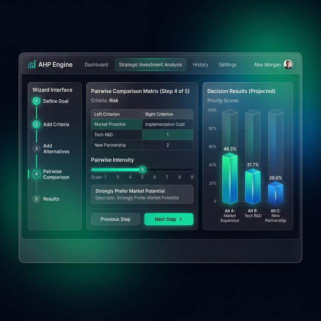

# AHP Engine - Decision Intelligence Tool




**AHP Engine** to zaawansowane narzędzie do wspierania procesów decyzyjnych oparte na metodzie **Analytic Hierarchy Process (AHP)**, opracowanej przez Thomasa L. Saaty'ego. Aplikacja pozwala na obiektywne porównanie wielu wariantów (alternatyw) na podstawie zestawu zdefiniowanych kryteriów, biorąc pod uwagę ich wagę oraz spójność logiczną ocen.

---

## 🚀 Główne Funkcje

- **Wieloetapowy Kreator Decyzji:** Intuicyjny proces od definicji struktury po finalny ranking.
- **Porównywanie Parami (Pairwise Comparison):** Wykorzystanie skali Saaty'ego do precyzyjnego określania preferencji.
- **Automatyczna Konwersja Wartości:** Możliwość wpisania surowych danych (np. cena w PLN, waga w kg), które system automatycznie zamienia na relacje AHP.
- **Weryfikacja Spójności (Consistency Check):** Obliczanie współczynnika CR (Consistency Ratio) w czasie rzeczywistym, informujące czy dokonane oceny są logicznie spójne.
- **Interaktywne Wizualizacje:** Czytelne wykresy i wskaźniki prezentujące rozkład wag oraz ranking końcowy.
- **Nowoczesny Design:** Interfejs typu *Glassmorphism* z dynamicznymi animacjami i pełną responsywnością.

---

## 🛠 Jak to działa? (Proces AHP)

### Krok 1: Struktura
Zdefiniuj co chcesz ocenić (Alternatywy) oraz jakie czynniki są dla Ciebie istotne (Kryteria). Możesz określić kierunek kryterium:
- **MAX:** Im wyższa wartość, tym lepiej (np. jakość, wydajność).
- **MIN:** Im niższa wartość, tym lepiej (np. cena, czas dostawy).

### Krok 2: Macierz Kryteriów
Porównaj kryteria między sobą, określając który czynnik jest ważniejszy i w jakim stopniu. System obliczy wagi globalne dla każdego kryterium.

### Krok 3: Ocena Alternatyw
Dla każdego kryterium oceń, jak wypadają poszczególne opcje. Możesz to zrobić manualnie (suwakami) lub wpisując konkretne wartości liczbowe.

### Krok 4: Wyniki
System wykonuje syntezę wag i prezentuje ostateczny ranking. Dowiesz się, która opcja jest najbliższa matematycznemu ideałowi Twoich preferencji.

---

## 🧮 Matematyka w tle

Silnik obliczeniowy (`ahpEngine.ts`) implementuje standardowy algorytm AHP:
1. **Budowa macierzy porównań** na podstawie suwaków (skala 1-9).
2. **Normalizacja kolumn** i wyliczanie średnich wierszowych w celu uzyskania wektora wag.
3. **Obliczanie λ_max** (największej wartości własnej).
4. **Wyznaczanie CI (Consistency Index):** $CI = \frac{\lambda_{max} - n}{n - 1}$
5. **Obliczanie CR (Consistency Ratio):** $CR = \frac{CI}{RI}$, gdzie RI to indeks losowy.
   * *Przyjmuje się, że CR < 0.1 oznacza spójne i wiarygodne oceny.*

---

## 💻 Stos Technologiczny

- **Framework:** [React 19](https://react.dev/)
- **Runtime:** [Bun](https://bun.sh/)
- **Stylizacja:** Tailwind CSS (v4)
- **Komponenty UI:** Radix UI / shadcn/ui
- **Wizualizacje:** Recharts
- **Ikony:** Lucide React

---

## ⚙️ Instalacja i Uruchomienie

Aby zainstalować zależności:
```bash
bun install
```

Aby uruchomić serwer deweloperski:
```bash
bun dev
```

Aby zbudować wersję produkcyjną:
```bash
bun run build
bun start
```

---

## 📁 Struktura Projektu

- `src/components/ahp/ahpEngine.ts` - Logika matematyczna AHP.
- `src/components/ahp/AHPCalculator.tsx` - Główny komponent aplikacji (Wizard).
- `src/components/ahp/Step1-4` - Poszczególne etapy procesu decyzyjnego.
- `src/lib/utils.ts` - Narzędzia pomocnicze dla Tailwind i stylizacji.

---

*Wspieraj swoje decyzje nauką, nie tylko przeczuciem.*
